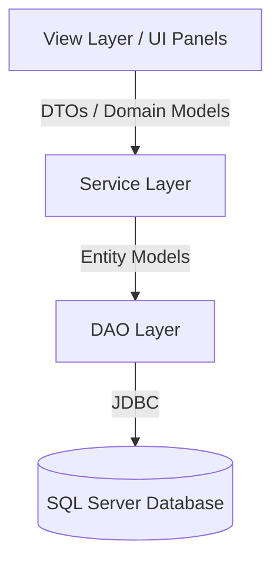

<h1 align="center">
  🍿 Cinema POS & Management System
</h1>

<p align="center">
  
  
  
  
  
</p>

<p align="center">
  <strong>An enterprise-grade, high-performance Point of Sale (POS) and Management System for Cinemas, built with Java Swing and SQL Server.</strong>
</p>

---

## 📑 Table of Contents

1. [Project Overview](#1-project-overview)
2. [Features](#2-features)
3. [Screenshots](#3-screenshots)
4. [Tech Stack](#4-tech-stack)
5. [Project Architecture](#5-project-architecture)
6. [Folder Structure](#6-folder-structure)
7. [Database Design](#7-database-design)
8. [Setup & Installation](#8-setup--installation)
9. [Running The Application](#9-running-the-application)
10. [Core Business Flows](#10-core-business-flows)
11. [Clean Architecture & Design Patterns](#11-clean-architecture--design-patterns)
12. [Security](#12-security)
13. [Future Improvements](#13-future-improvements)
14. [Performance Notes](#14-performance-notes)
15. [Known Issues & Refactoring Opportunities](#15-known-issues--refactoring-opportunities)
16. [Author](#16-author)

---

## 1. Project Overview

**Cinema POS** is a comprehensive, desktop-based management application designed to streamline the daily operations of a modern cinema. It handles everything from movie and showtime scheduling, interactive seat booking, and transaction processing to robust dashboard analytics. 

**Goals:**
- Provide a blazing-fast, intuitive POS interface for cinema staff to quickly serve customers.
- Equip cinema managers with powerful tools for inventory (halls, movies, showtimes) and employee management.
- Establish a strict, maintainable, and scalable **3-Layer Architecture** (UI ➔ Service ➔ DAO) to separate business logic from data persistence.

---

## 2. Features

### 🔐 Authentication & Authorization
- Secure login mechanism with Role-Based Access Control (RBAC).
- Specialized views for **Manager** (Full Access) and **Staff** (Restricted Access).

### 🎬 Movie Management
- Full CRUD operations for movies (Title, Genre, Duration, Rating, Poster, etc.).
- Active/Inactive toggling to manage currently showing films.

### 📅 Showtime Management
- Schedule movies into cinema halls with specific start/end times.
- Prevent overlapping schedules with robust validation algorithms.
- Automatic seat generation for each scheduled showtime.

### 🎟️ Ticket Booking & POS
- Interactive, real-time visual **Seat Map** (VIP, Regular, Broken, Booked).
- Shopping cart functionality with real-time total calculation.
- Support for multiple payment methods (Cash, Credit Card, Bank Transfer).

### 🧾 Invoice & Transactions
- Complete transaction history tracking.
- Staff can view their own transactions; Managers can view all.
- Automatic barcode generation and **PDF Ticket Export**.

### 💸 Discount System
- Validate and apply promotional discount codes during checkout.

### 📊 Dashboard Statistics
- Real-time animated charts showing revenue over the last 30 days.
- Top 5 best-selling movies leaderboards with visual posters.
- Export transaction data to **Excel**.

---

## 3. Screenshots

> *Note: Placeholders for actual project screenshots.*

| Login & Authentication | Point of Sale (POS) |
|:---:|:---:|
|  |  |
| **Interactive Seat Map** | **Dashboard & Analytics** |
|  |  |
| **Showtime Scheduling** | **PDF Exported Ticket** |
|  |  |

---

## 4. Tech Stack

- **Language:** Java 17+
- **GUI Framework:** Java Swing (Custom styled for modern, flat UI)
- **Database:** Microsoft SQL Server
- **Data Access:** Pure JDBC (Optimized for performance)
- **Libraries:**
  - `iTextPDF`: Generating professional PDF invoices and tickets.
  - `Apache POI`: Exporting analytics and transactions to Excel.
  - `JCalendar / JDateChooser`: Advanced date picking UI components.

---

## 5. Project Architecture

The application strictly enforces a **3-Layer Architecture** to guarantee the Single Responsibility Principle (SRP) and high maintainability.



- **View Layer (Panels/Dialogs):** Handles user interactions, captures input, and strictly delegates business operations to Services. *Never interacts with DAOs directly.*
- **Service Layer (`Service`):** The orchestrator. Contains all business logic, workflow validations, ID generation, and transaction management (Commit/Rollback). 
- **DAO Layer (`DAO`):** Pure Data Access Objects. Contains only SQL statements (`INSERT`, `SELECT`, `UPDATE`). Receives `Connection` objects from Services for transactional consistency.
- **Model Layer (`Model`):** POJOs (Plain Old Java Objects) representing database entities.

---

## 6. Folder Structure

```text
src/main/java/com/rapphim/
├── config/             # Database connection pooling & configurations
├── controller/         # Action handlers for complex UI flows (e.g., LoginController)
├── dao/                # Data Access Objects (SQL queries, ResultSet mapping)
├── model/              # Domain entities and Enums (Movie, Showtime, Ticket, etc.)
├── service/            # Business logic, Orchestration, Transaction boundaries
├── util/               # Helper utilities (PDF Exporter, Excel Exporter, Formatters)
└── view/               # UI Layer
    ├── dialogs/        # Modal windows (Add/Edit items, Payment forms)
    └── panels/         # Main screens (Dashboard, POS, Showtimes, Settings)
```

---

## 7. Database Design

The database is normalized to 3NF to ensure data integrity and prevent redundancy.

### Core Tables:
1. `employees`: Stores user credentials and roles (Manager/Staff).
2. `movies`: Movie metadata (Title, duration, rating, poster URL).
3. `cinema_halls`: Physical halls containing seating capacity metadata.
4. `seats`: Physical seats mapped to specific halls.
5. `showtimes`: Timetable linking a `Movie` to a `CinemaHall`.
6. `show_seats`: Junction table reflecting the *status* of a seat for a specific showtime (Available/Booked).
7. `invoices`: Financial records of a checkout session.
8. `tickets`: Individual ticket records linked to an invoice and a show_seat.

### ERD Overview (ASCII):
```text
[employees] 1 ---- * [invoices] 1 ---- * [tickets]
                                            | 1
[movies] 1 --- * [showtimes] 1 --- * [show_seats]
                      | 1                   * |
[cinema_halls] 1 -----+----------------- 1 [seats]
```

---

## 8. Setup & Installation

### Prerequisites:
- Java JDK 17 or higher.
- Microsoft SQL Server (2019+).
- Maven (optional, if migrating to a managed build system).

### Step-by-Step:
1. **Clone the repository:**
   ```bash
   git clone https://github.com/yourusername/cinema-pos.git
   cd cinema-pos
   ```
2. **Setup Database:**
   - Open SQL Server Management Studio (SSMS).
   - Execute the initialization script located at `database/init_schema.sql` to create the schema and seed initial data.
3. **Configure Connection:**
   - Navigate to `src/main/java/com/rapphim/config/DatabaseConnection.java`.
   - Update the JDBC connection string, username, and password to match your local SQL Server instance.
4. **Compile & Run:**
   - Open the project in IntelliJ IDEA, Eclipse, or VS Code.
   - Run the `Main.java` class to launch the application.

---

## 9. Running The Application

1. **Login Screen:** Use `admin` / `admin` for Manager access, or `staff` / `staff` for Staff access.
2. **Dashboard (Manager Only):** View the 30-day revenue chart and top-selling movies.
3. **Sales / POS:** 
   - Select a movie ➔ Select a showtime.
   - Click on the interactive seat map to add tickets to the cart.
   - Click **Thanh toán (Checkout)**, select payment method, and confirm.
   - PDF invoices and tickets will automatically generate in the project root.

---

## 10. Core Business Flows

### Ticket Booking Workflow (Checkout Orchestration)
The checkout process is a highly transactional workflow handled by `SaleService`:
1. Validates the cart and selected showtime.
2. **Disables Auto-Commit** on the JDBC connection to start a transaction.
3. Generates consecutive Invoice and Ticket IDs.
4. Inserts the `Invoice` record.
5. Iterates through the cart:
   - Verifies seat availability (`show_seats`).
   - Updates seat status to `BOOKED`.
   - Generates a unique Barcode.
   - Inserts the `Ticket` record.
6. **Commits** the transaction. (Rolls back entirely if any step fails).
7. Triggers the PDF export utility.

---

## 11. Clean Architecture & Design Patterns

- **DAO Pattern:** Abstracts and encapsulates all access to the data source.
- **Service Layer Pattern:** Encapsulates business logic and orchestrates multiple DAOs. Connection objects are passed from Service to DAO to ensure transaction boundaries are respected.
- **Singleton Pattern:** Used for `DatabaseConnection` to manage a shared connection instance (can be upgraded to a Connection Pool like HikariCP).
- **Observer / Callback Pattern:** Used in Swing UI components for event-driven updates (e.g., updating the cart UI when a seat is clicked).

---

## 12. Security

- **Role-Based Access Control (RBAC):** UI dynamically renders based on the logged-in user's role. Staff cannot access Settings, Dashboard, or Employee management.
- **SQL Injection Prevention:** 100% usage of `PreparedStatement` for all dynamic database queries.
- **Transaction Safety:** ACID compliance guaranteed during ticket sales to prevent race conditions (double-booking the same seat).

---

## 13. Future Improvements

To scale this monolithic desktop app to a modern enterprise ecosystem:
- **Migration to Spring Boot:** Convert the backend into a RESTful API.
- **Web/Mobile Frontend:** Replace Java Swing with React.js (Admin/Staff Web) and React Native (Customer Mobile App).
- **Connection Pooling:** Integrate **HikariCP** to manage database connections more efficiently.
- **Password Hashing:** Implement BCrypt for storing employee passwords securely.
- **Caching:** Integrate Redis to cache the `Showtime` seat map, reducing database hits during high-traffic bookings.

---

## 14. Performance Notes

- **JDBC Optimization:** The system reuses prepared statements and leverages `Connection` passing to execute batch inserts within a single database transaction.
- **Lazy Loading:** UI panels (like Showtimes and Transactions) implement manual data refreshing and background loading (`SwingWorker`) to prevent UI thread blocking.
- **Indexing:** Ensure indexes are created on `showtime_id` and `seat_id` in the `show_seats` table to optimize the heavy read/write operations during checkout.

---

## 15. Known Issues & Refactoring Opportunities

*Recently refactored to eliminate architectural violations (e.g., UI directly calling DAOs, DAOs handling business logic).*
- **Tight Coupling in UI:** Some Swing Panels are quite large. Future refactoring should abstract complex UI components (like the Seat Grid) into separate classes.
- **Global State:** Currently, `AuthService` stores the logged-in user as a static variable. Moving to a Context-based dependency injection framework would improve testability.

---

## 16. Author

**Senior Software Engineer**  
- 💼 **Portfolio:** [your-portfolio.com](#)
- 🐙 **GitHub:** [@yourusername](https://github.com/yourusername)
- ✉️ **Contact:** your.email@example.com

<p align="center">
  <i>If you find this project interesting, consider giving it a ⭐!</i>
</p>
