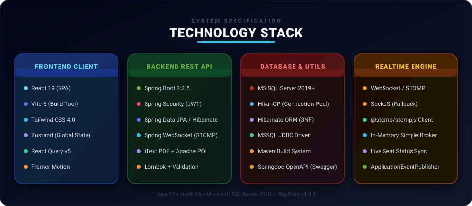
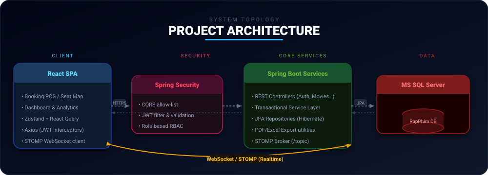
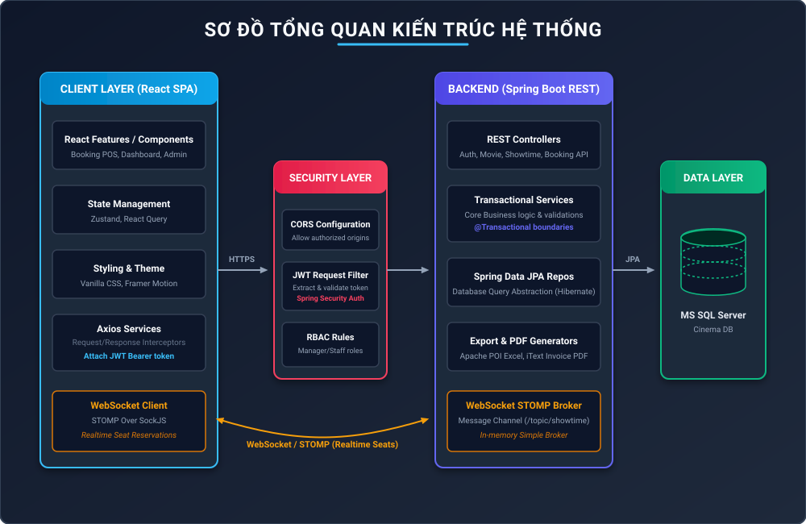
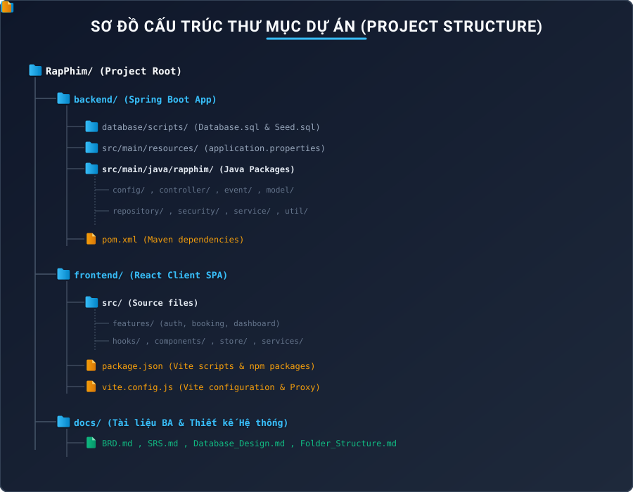
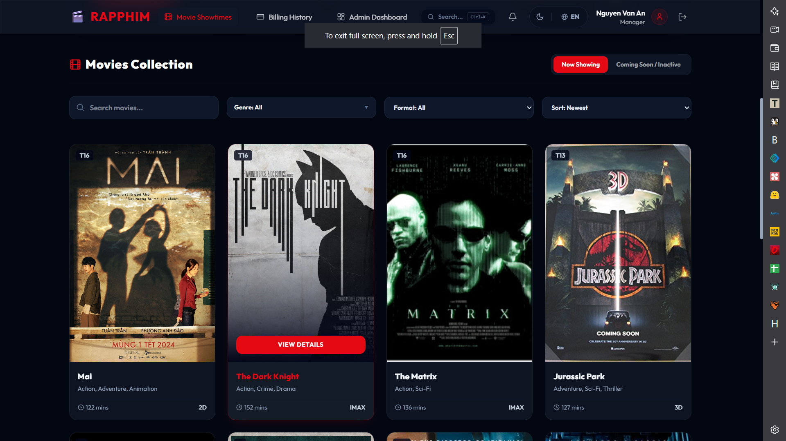
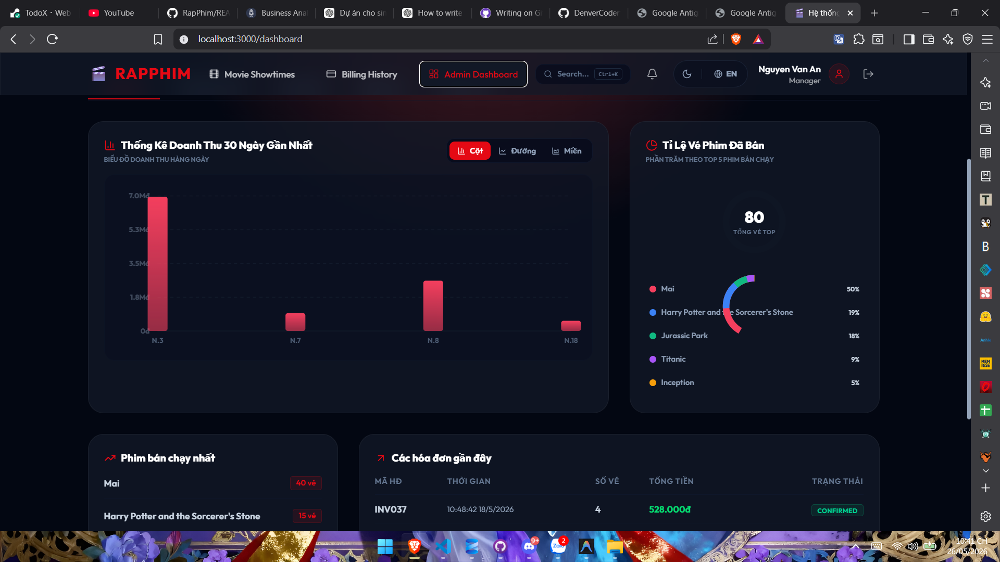

# 🍿 RapPhim - Modern Cinema POS & Management System

<p align="center">
  <a href="https://github.com/vtgh04/RapPhim/actions/workflows/ci-cd.yml">
    
  </a>
</p>

<p align="center">
  
  
  
  
  
  
</p>

**Hệ thống bán vé (POS) tại quầy và quản trị rạp chiếu phim chuyên nghiệp được thiết kế theo kiến trúc Web hiện đại, phân tách rõ rệt giữa Spring Boot Backend REST API và React Client (SPA) sử dụng công nghệ WebSocket đồng bộ thời gian thực.**

---

## 📑 Tài Liệu Phân Tích Nghiệp Vụ & Thiết Kế Hệ Thống Hợp Nhất (BA Docs)

Hệ thống được thiết kế, đặc tả chuyên nghiệp theo chuẩn tài liệu BA và đã được hợp nhất thành một tài liệu duy nhất để dễ quản lý, theo dõi:
* **[Tài liệu Nghiệp vụ & Thiết Kế Hệ Thống Chi Tiết (DOCUMENTATION.md)](docs/DOCUMENTATION.md)**

Tài liệu hợp nhất này bao gồm:
1. **Tài liệu Yêu cầu Nghiệp vụ (BRD):** Bối cảnh, mục tiêu chiến lược, sơ đồ phân quyền Stakeholders, phạm vi (In-scope/Out-of-scope) và các chỉ số KPIs.
2. **Đặc tả Yêu cầu Phần mềm (SRS):** Danh sách User Stories, Luật nghiệp vụ tính giá vé & kiểm tra trùng lịch chiếu, Đặc tả Use Case và luồng đi Sequence.
3. **Thiết kế Cơ sở Dữ liệu & Class:** Sơ đồ ERD chuẩn hóa 3NF của 9 bảng cơ sở dữ liệu và cách ánh xạ Entities trong JPA Hibernate.

---

## 🎨 Sơ Đồ Hệ Thống Trực Quan (SVG Diagrams)

### 1. Công Nghệ Sử Dụng (Technology Stack)
Các công nghệ cốt lõi của Frontend client, Backend API, Database và Realtime Engine.



---

### 2. Kiến Trúc Chi Tiết / Cấu Trúc Các Lớp (Project Architecture Topology)
Mô hình kết nối HTTPS REST API và đồng bộ WebSocket STOMP thời gian thực.



---

### 3. Kiến Trúc Tổng Quan (System Architecture Overview)
Phân lớp hệ thống từ Client UI, Security Gateway, Core Service đến Data Storage.



---

### 4. Cấu Trúc Thư Mục Dự Án (Project Folder Structure)
Bố cục cấu trúc phân vùng nghiệp vụ và tổ chức mã nguồn chuẩn hóa.



---

## 🌟 Tính Năng Nổi Bật Đang Hoạt Động
* **Xác thực Dual-Token JWT:** Bảo mật tuyệt đối với Access Token & Refresh Token, tự động xoay vòng token ngầm ở Client để không ngắt quãng phiên làm việc.
* **Giao diện bán vé POS & Sơ đồ ghế động:** Vẽ động bản đồ phòng chiếu theo số hàng và cột của phòng, phân biệt ghế VIP/Thường, ghế hỏng, ghế đã mua.
* **Đồng bộ ghế Realtime (WebSocket/STOMP):** Ngăn chặn hoàn toàn việc mua trùng ghế (Double Booking) giữa các quầy bán vé.
* **Tự động phòng tránh xung đột lịch chiếu:** Thuật toán Backend tự động tính toán thời gian kết thúc dựa vào thời lượng phim, chặn lưu suất chiếu nếu phát hiện phòng bị trùng hoặc chồng lấn thời gian.
* **Cascade Delete Showtime:** Xóa suất chiếu tự động xóa sạch dữ liệu ghế động liên quan trong cùng một ranh giới `@Transactional` an toàn.
* **Xuất hoá đơn & Vé PDF chứa Barcode:** Sử dụng Apache POI và iText xuất hoá đơn kèm vé có mã vạch sẵn sàng phục vụ kiểm vé.
* **Dashboard Biểu đồ SVG Động:** Dashboard thống kê doanh thu, cơ cấu vé bán hiển thị bằng biểu đồ SVG do hệ thống tự tính toán toạ độ vẽ, không phụ thuộc vào thư viện bên thứ ba.
* **Đa ngôn ngữ (i18n):** Chuyển đổi ngôn ngữ Việt - Anh tức thời trên toàn bộ giao diện.

---

## 🛠️ Điểm Cộng Kỹ Thuật & Thực Hành Kỹ Nghệ Phần Mềm (Software Engineering Best Practices)

Dự án được xây dựng tuân thủ nghiêm ngặt các thực hành kỹ nghệ phần mềm chuyên nghiệp mà các nhà tuyển dụng và Tech Lead luôn đánh giá cao:
* **Container hóa hoàn chỉnh (Docker & Compose):** Đóng gói toàn bộ hệ sinh thái thành các service độc lập (`sqlserver`, `backend`, `frontend`, `db-init`) kết nối qua mạng ảo nội bộ, giúp chạy toàn bộ dự án trên máy mới chỉ bằng 1 lệnh duy nhất.
* **Quy trình Khởi tạo dữ liệu tự động (Auto Database Bootstrapping):** Tích hợp container phụ trợ `db-init` có nhiệm vụ đợi SQL Server khởi động hoàn tất, tự động nạp cấu trúc database [Database.sql](file:///c:/Users/ADMIN/Desktop/CinemaProject/RapPhim/backend/database/scripts/Database.sql) và dữ liệu mẫu [Seed.sql](file:///c:/Users/ADMIN/Desktop/CinemaProject/RapPhim/backend/database/scripts/Seed.sql), đồng bộ luồng giúp backend không bị crash khi kết nối.
* **Tự động hóa kiểm thử & Tích hợp liên tục (CI/CD):** Thiết lập quy trình tự động hóa kiểm thử trên **GitHub Actions** (`.github/workflows/ci-cd.yml`). Mỗi khi có code mới push lên, hệ thống tự động kiểm thử Unit/Integration Test trên Backend (JUnit 5 + H2) và Component Test trên Frontend (Vitest + JSDOM).
* **Bảo mật thông tin nhạy cảm (Environment Variables):** Tuân thủ triết lý **12-Factor App**, tách toàn bộ thông tin tài khoản DB, khóa bảo mật JWT Secret ra ngoài mã nguồn, quản lý tập trung thông qua biến môi trường (.env) và Docker Environments.
* **Tài liệu & Thiết kế Hệ thống chuẩn chỉ:** Cung cấp đầy đủ file đặc tả nghiệp vụ chi tiết [DOCUMENTATION.md](file:///c:/Users/ADMIN/Desktop/CinemaProject/RapPhim/docs/DOCUMENTATION.md) (BRD, SRS, Database Schema, Class) kèm bộ sơ đồ thiết kế SVG sắc nét.

---

## 🖥️ Giao Diện Ứng Dụng (User Interfaces)

### 1. Trang Chủ & Danh Sách Phim (Main Landing Page)
Giao diện trang chủ hiển thị danh sách các bộ phim đang hoạt động với hiệu ứng hover mượt mà, tích hợp thanh tìm kiếm toàn cục thông minh (phím tắt `Ctrl + K` hoặc `⌘ + K`) và cụm chuyển đổi đa ngôn ngữ/chế độ sáng tối tức thì.



---

### 2. Giao Diện Đặt Vé POS & Bản Đồ Ghế (Ticket Booking Seat Map)
Giao diện bán vé tại quầy (POS) cho nhân viên rạp. Sơ đồ ghế ngồi được vẽ động hoàn toàn dựa trên kích thước phòng chiếu cứng, tự động phân loại màu sắc loại ghế VIP (vàng)/Thường (slate), nhận diện ghế hỏng (xám gạch chéo), ghế đã được người khác đặt (đỏ) và phát sóng đồng bộ trạng thái khóa ghế tạm thời (LIVE) qua kết nối WebSocket.


---

### 3. Bảng Quản Trị & Biểu Đồ Thống Kê (Manager Dashboard & SVG Charts)
Bảng điều khiển dành cho Quản lý rạp, tích hợp các thẻ thống kê tổng quan doanh thu/vé bán và bộ biểu đồ SVG động do hệ thống tự tính toán tọa độ vẽ (dạng Cột, Đường, Miền và Biểu đồ Tròn thị phần) cập nhật dữ liệu thời gian thực.



---

## 🏃 Hướng Dẫn Cài Đặt & Chạy Ứng Dụng

### Điều kiện tiên quyết
* **Java JDK 17** hoặc cao hơn
* **Node.js** (v18+) & **npm**
* **Microsoft SQL Server** (đã chạy các script khởi tạo tại `backend/database/scripts/Database.sql` và `Seed.sql`)

### 1. Khởi chạy Backend API
```bash
cd backend
# Cấu hình db credentials trong src/main/resources/application.properties trước khi chạy
.\mvnw.cmd spring-boot:run
```
*Backend API sẽ chạy tại cổng `5001`.*

### 2. Khởi chạy Frontend Client
```bash
cd frontend
npm install
npm run dev
```
*Frontend sẽ chạy tại cổng `3000` (hoặc cổng được Vite cấp phát, proxy tự động trỏ về backend cổng `5001`).*

---

## 🐙 Tác Giả & Bản Quyền

* **GitHub:** [@vtgh04](https://github.com/vtgh04)
* **Email:** vtgh1602@gmail.com

*Nếu dự án này giúp ích cho bạn, hãy tặng 1 ⭐ trên repository nhé!*
