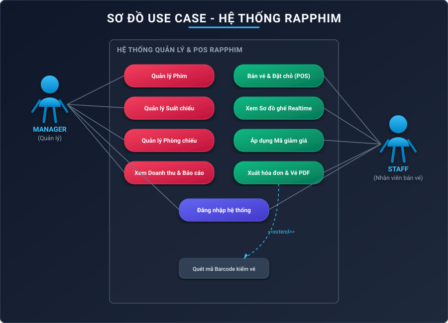
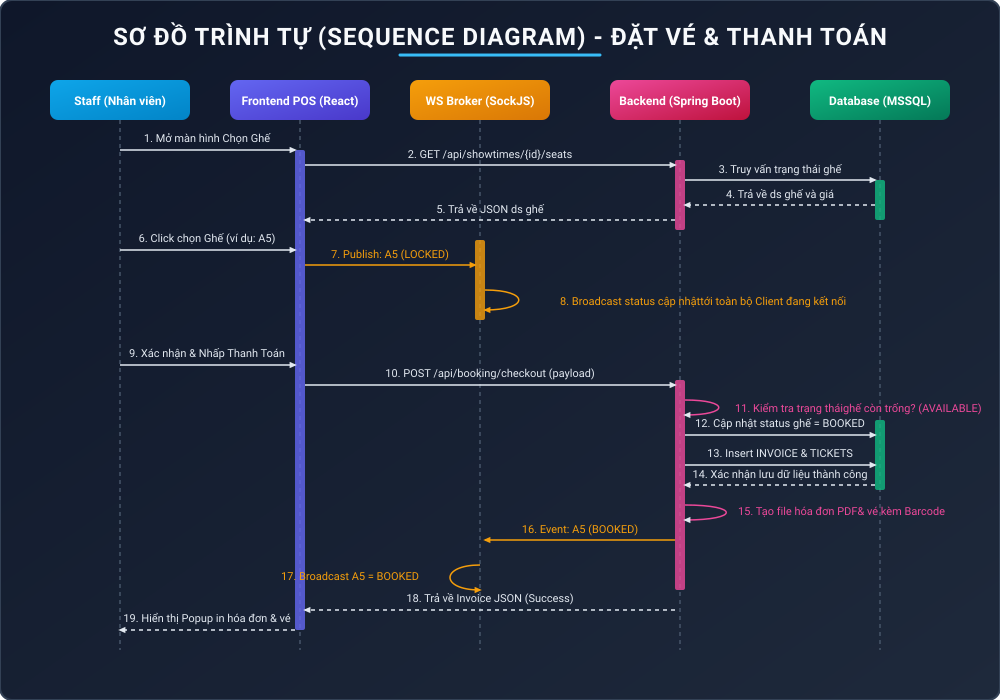
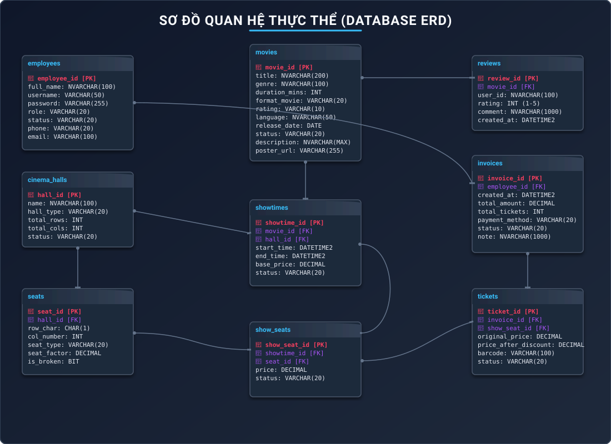
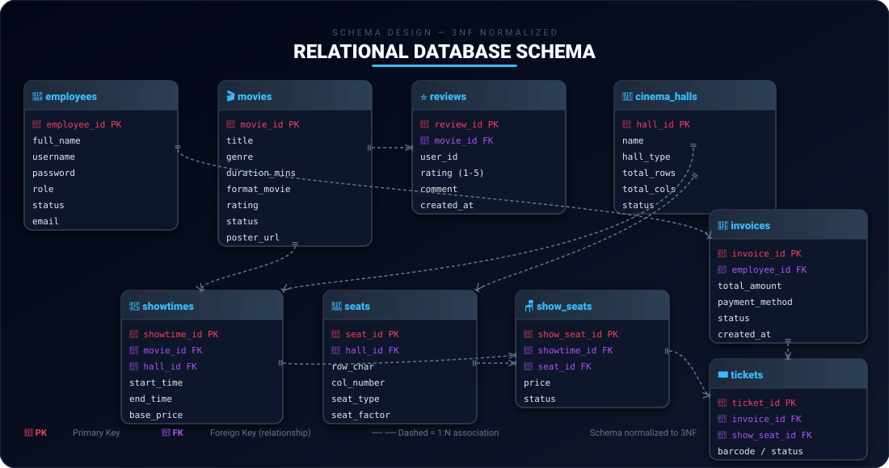
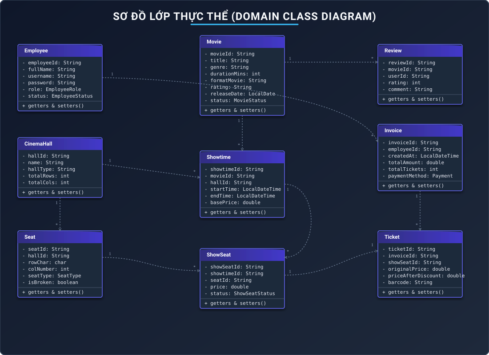

# 🍿 RapPhim - Modern Cinema POS & Management System

<p align="center">
  
  
  
  
  
  
</p>

**Hệ thống bán vé (POS) tại quầy và quản trị rạp chiếu phim chuyên nghiệp được thiết kế theo kiến trúc Web hiện đại, phân tách rõ rệt giữa Spring Boot Backend REST API và React Client (SPA) sử dụng công nghệ WebSocket đồng bộ thời gian thực.**

---

## 📑 Tài Liệu Phân Tích Nghiệp Vụ & Thiết Kế Hệ Thống Hợp Nhất (BA Docs)

Hệ thống được thiết kế, đặc tả chuyên nghiệp theo chuẩn tài liệu BA và đã được hợp nhất thành một tài liệu duy nhất để dễ quản lý, theo dõi:
* **[Tài liệu Nghiệp vụ & Thiết Kế Hệ Thống Chi Tiết (DOCUMENTATION.md)](docs/DOCUMENTATION.md)**

Tài liệu hợp nhất này bao gồm:
1. **Tài liệu Yêu cầu Nghiệp vụ (BRD):** Bối cảnh, mục tiêu chiến lược, sơ đồ phân quyền Stakeholders, phạm vi (In-scope/Out-of-scope) và các chỉ số KPIs.
2. **Đặc tả Yêu cầu Phần mềm (SRS):** Danh sách User Stories, Luật nghiệp vụ tính giá vé & kiểm tra trùng lịch chiếu, Đặc tả Use Case và luồng đi Sequence.
3. **Thiết kế Cơ sở Dữ liệu & Class:** Sơ đồ ERD chuẩn hóa 3NF của 9 bảng cơ sở dữ liệu và cách ánh xạ Entities trong JPA Hibernate.
4. **9 Sơ đồ SVG Trực quan:** Hệ thống các sơ đồ kiến trúc, cơ sở dữ liệu, Use Case, Sequence, cấu trúc thư mục được thiết kế bằng SVG.

---

## 🎨 Sơ Đồ Hệ Thống Trực Quan (SVG Diagrams)

### 1. Công Nghệ Sử Dụng (Technology Stack)
Các công nghệ cốt lõi của Frontend client, Backend API, Database và Realtime Engine.


---

### 2. Kiến Trúc Chi Tiết / Cấu Trúc Các Lớp (Project Architecture Topology)
Mô hình kết nối HTTPS REST API và đồng bộ WebSocket STOMP thời gian thực.


---

### 3. Kiến Trúc Tổng Quan (System Architecture Overview)
Phân lớp hệ thống từ Client UI, Security Gateway, Core Service đến Data Storage.


---

### 4. Sơ đồ Use Case phân quyền người dùng (Use Case Diagram)
Phân quyền chức năng rạch ròi giữa vai trò Quản lý (Manager) và Nhân viên bán vé (Staff).



---

### 5. Sơ đồ Trình tự Đặt Vé & Thanh Toán (Sequence Diagram)
Trình tự tương tác giữa Nhân viên quầy, Client, WebSocket Broker, Server và Database trong suốt vòng đời chọn ghế, khóa ghế tạm thời và checkout in hóa đơn.



---

### 6. Sơ đồ Thực Thể Quan Hệ (Entity Relationship Diagram - ERD)
Cơ sở dữ liệu được chuẩn hoá 3NF của hệ thống chạy trên Microsoft SQL Server.



---

### 7. Sơ đồ Cơ Sở Dữ Liệu Quan Hệ (Database Relational Schema)
Đặc tả chi tiết cấu trúc khoá chính, khoá ngoại và liên kết bảng.



---

### 8. Sơ đồ Lớp Thực Thể (Domain Class Diagram)
Cấu trúc lớp Domain JPA Entity trong Spring Boot Backend mô tả đầy đủ các thuộc tính và quan hệ liên kết.



---

### 9. Cấu Trúc Thư Mục Dự Án (Project Folder Structure)
Bố cục cấu trúc phân vùng nghiệp vụ và tổ chức mã nguồn chuẩn hóa.


---

## 🌟 Tính Năng Nổi Bật Đang Hoạt Động
* **Xác thực Dual-Token JWT:** Bảo mật tuyệt đối với Access Token & Refresh Token, tự động xoay vòng token ngầm ở Client để không ngắt quãng phiên làm việc.
* **Giao diện bán vé POS & Sơ đồ ghế động:** Vẽ động bản đồ phòng chiếu theo số hàng và cột của phòng, phân biệt ghế VIP/Thường, ghế hỏng, ghế đã mua.
* **Đồng bộ ghế Realtime (WebSocket/STOMP):** Ngăn chặn hoàn toàn việc mua trùng ghế (Double Booking) giữa các quầy bán vé.
* **Tự động phòng tránh xung đột lịch chiếu:** Thuật toán Backend tự động tính toán thời gian kết thúc dựa vào thời lượng phim, chặn lưu suất chiếu nếu phát hiện phòng bị trùng hoặc chồng lấn thời gian.
* **Cascade Delete Showtime:** Xóa suất chiếu tự động xóa sạch dữ liệu ghế động liên quan trong cùng một ranh giới `@Transactional` an toàn.
* **Xuất hoá đơn & Vé PDF chứa Barcode:** Sử dụng Apache POI và iText xuất hoá đơn kèm vé có mã vạch sẵn sàng phục vụ kiểm vé.
* **Dashboard Biểu đồ SVG Động:** Dashboard thống kê doanh thu, cơ cấu vé bán hiển thị bằng biểu đồ SVG do hệ thống tự tính toán toạ độ vẽ, không phụ thuộc vào thư viện bên thứ ba.
* **Đa ngôn ngữ (i18n):** Chuyển đổi ngôn ngữ Việt - Anh tức thời trên toàn bộ giao diện.

---

## 🏃 Hướng Dẫn Cài Đặt & Chạy Ứng Dụng

### Điều kiện tiên quyết
* **Java JDK 17** hoặc cao hơn
* **Node.js** (v18+) & **npm**
* **Microsoft SQL Server** (đã chạy các script khởi tạo tại `backend/database/scripts/Database.sql` và `Seed.sql`)

### 1. Khởi chạy Backend API
```bash
cd backend
# Cấu hình db credentials trong src/main/resources/application.properties trước khi chạy
.\mvnw.cmd spring-boot:run
```
*Backend API sẽ chạy tại cổng `5001`.*

### 2. Khởi chạy Frontend Client
```bash
cd frontend
npm install
npm run dev
```
*Frontend sẽ chạy tại cổng `3000` (hoặc cổng được Vite cấp phát, proxy tự động trỏ về backend cổng `5001`).*

---

## 🐙 Tác Giả & Bản Quyền

* **GitHub:** [@vtgh04](https://github.com/vtgh04)
* **Email:** vtgh1602@gmail.com

*Nếu dự án này giúp ích cho bạn, hãy tặng 1 ⭐ trên repository nhé!*
