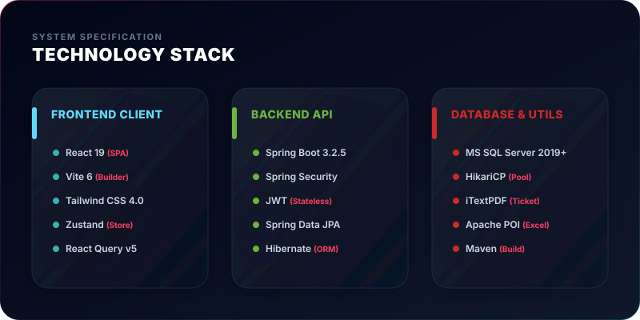
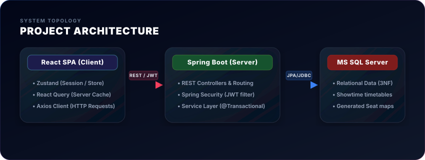

# 🍿 RapPhim - Modern Cinema POS & Management System

<p align="center">
  
  
  
  
  
  
</p>

<p align="center">
  <strong>An enterprise-grade, high-performance web application for Cinema Point of Sale (POS) and administration, built with Spring Boot and React.</strong>
</p>

---

## 🚀 Project Migration & Current Status

> [!IMPORTANT]
> **Architecture Modernization:** The project has successfully transitioned from its original desktop version (Java Swing + JDBC) to a decoupled Web Application. The application now uses a **Spring Boot REST API backend** and a **React SPA frontend** built with Vite and Tailwind CSS.

### Recent Accomplishments (Real-time updates)
- [x] **REST API Modernization:** Replaced Swing controllers and JDBC DAOs with Spring REST Controllers and Spring Data JPA.
- [x] **JWT Security Integration:** Secured endpoints with stateless JWT authentication and role-based filters.
- [x] **Interactive Dashboard Analytics:** Designed and built responsive, fully custom SVG charts (Line, Bar, Area, and Donut) for financial metrics without external chart libraries.
- [x] **Visual Showtime Scheduler:** Replaced raw tables with a card-based visual movie scheduling interface.
- [x] **Cascade Showtime Operations:** Enabled showtime deletion that cleans up linked dynamically generated seats automatically in a single `@Transactional` boundary.

---

## 📑 Table of Contents

1. [Features](#-features)
2. [Tech Stack](#%EF%B8%8F-tech-stack)
3. [Project Architecture](#-project-architecture)
4. [Folder Structure](#-folder-structure)
5. [Database Design](#-database-design)
6. [API Endpoints](#-api-endpoints)
7. [Setup & Installation](#-setup--installation)
8. [Running the Application](#-running-the-application)
9. [Author](#-author)

---

## 🌟 Features

### 🔐 Authentication & Authorization
* Secure login using stateless JWT tokens.
* Auto token-rotation via interceptors on the React client.
* Role-Based Access Control (RBAC): UI panels and API requests are protected based on employee roles (`MANAGER` / `STAFF`).

### 📊 Dashboard Statistics & Charts
* **Interactive SVG Revenue Chart:** View daily income trends over the last 30 days in **Bar (Cột)**, **Line (Đường)**, or **Area (Miền)** mode with hover details.
* **Movie Share Donut Chart:** A visual donut chart showing tickets distribution amongst top-selling movies with an interactive legend.

### 📅 Showtime Management
* Available movies display as rich visual cards indicating their schedule counts.
* Interactive side-panel detailing individual movie configurations.
* **Auto End-time Calculation:** The scheduler automatically adds the showtime end time using the movie duration.
* **Conflict Prevention:** Real-time checking to ensure no room conflicts or overlaps.
* **Cascade Delete:** Easily remove showtimes; automatically removes all generated seat layouts.

### 🎟️ Point of Sale (POS) & Checkout
* Interactive visual seating map (VIP, Regular, Broken, Booked seats).
* Real-time cart calculations and support for discounts and promo codes.
* Generates PDF invoices and printable barcodes/tickets upon successful checkout.

---

## 🛠️ Tech Stack



---

## 📐 Project Architecture

The application has been restructured into a decoupled web framework:



---

## 📁 Folder Structure

### Backend (`/backend`)
```text
src/main/java/rapphim/
├── config/             # Security configs, Web MVC configurations, CORS setup
├── controller/         # Spring REST Controllers (Auth, Movies, Showtimes, Dashboard)
├── event/              # Event listeners and handlers (e.g. seeding, logging)
├── model/              # Hibernate Entities and Enums (Movie, Showtime, ShowSeat, etc.)
├── repository/         # Spring Data JPA Repositories
├── security/           # JWT Filters, Token Providers, UserDetailsService
├── service/            # Core business workflows and transactional limits (@Transactional)
└── util/               # PDF/Excel exporters, converters, and date helpers
```

### Frontend (`/frontend`)
```text
src/
├── features/           # Feature-based folder structure
│   ├── auth/           # Login, Session state, and Auth Store
│   ├── booking/        # POS, Invoices, Seat selections
│   └── dashboard/      # Analytical panels, custom SVG charts
├── services/           # Axios instance with request/response interceptors
├── shared/             # Reusable UI elements (Spinners, Buttons)
├── index.css           # Global typography and theme configurations
└── main.jsx            # React root mount
```

---

## 🗄️ Database Design

The relational database is optimized for ACID transactions, especially during concurrent seat bookings:

```text
[employees] 1 ---- * [invoices] 1 ---- * [tickets]
                                            | 1
[movies] 1 --- * [showtimes] 1 --- * [show_seats]
                      | 1                   * |
[cinema_halls] 1 -----+----------------- 1 [seats]
```

---

## 📡 API Endpoints

Below is a summary of the main REST endpoints:

| Endpoint | Method | Role Required | Description |
| :--- | :--- | :--- | :--- |
| `/api/auth/login` | `POST` | `All` | Authenticates user, returns Access + Refresh token |
| `/api/auth/refresh-token` | `POST` | `All` | Silent token renewal using Refresh token |
| `/api/dashboard/revenue-by-day` | `GET` | `MANAGER` | Daily revenue analytics for the last 30 days |
| `/api/dashboard/top-movies` | `GET` | `MANAGER` | Top 5 best selling movies and ticket counts |
| `/api/movies` | `GET` | `All` | Returns all available movies |
| `/api/movies` | `POST` | `MANAGER` | Add a new movie into the system |
| `/api/showtimes` | `GET` | `All` | Retrieve scheduled showtimes |
| `/api/showtimes` | `POST` | `MANAGER` | Schedule a showtime (auto-generates seat structures) |
| `/api/showtimes/{id}` | `DELETE` | `MANAGER` | Cancel a showtime (cascade deletes generated seats) |
| `/api/cinema-halls` | `GET` | `All` | Retrieve available cinema auditoriums |

---

## 📦 Setup & Installation

### Prerequisites
* **Java JDK 17** or higher
* **Node.js** (v18+) & **npm**
* **Microsoft SQL Server**

### 1. Database Setup
1. Open SQL Server Management Studio (SSMS) or command line database tool.
2. Run the SQL schema files located in `backend/src/main/resources/schema.sql` (if present) or execute the initialization scripts to create the database schema.
3. Configure JDBC configurations in `backend/src/main/resources/application.properties` (or YAML) with your local database URL, username, and password.

### 2. Run Backend API
```bash
cd RapPhim/backend
# Using Maven Wrapper to compile and run Spring Boot
.\mvnw.cmd spring-boot:run
```

### 3. Run Frontend Client
```bash
cd RapPhim/frontend
# Install dependencies
npm install
# Run in development mode (hot-reloads dynamically)
npm run dev
```

---

## 🏃 Running the Application

1. **Dashboard Access:** Open the browser and visit `http://localhost:5173`.
2. **Staff Credentials:** Login using role-authorized credentials.
3. **Showtimes Management:** Navigate to **Suất Chiếu** to click visual movie cards and add or delete showtimes.
4. **Checkout:** Select movie seats and checkout to test automatic invoice and PDF ticket generation.

---

## 🐙 Author

* **GitHub:** [@vtgh04](https://github.com/vtgh04)
* **Email:** vtgh1602@gmail.com

---
*If you find this project helpful, please drop a ⭐ on the repository!*
