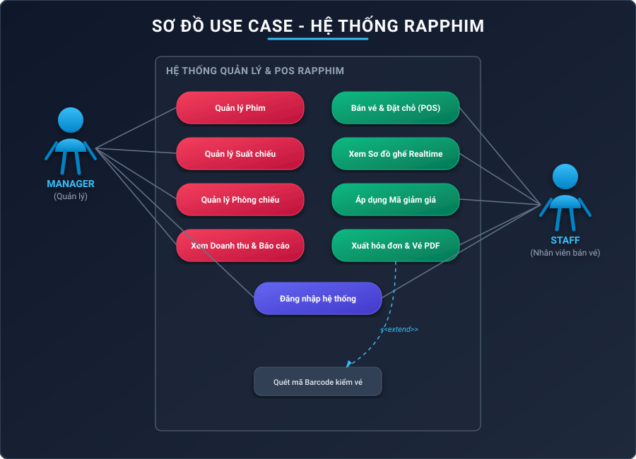

# Use Cases Document
## Project Name: RapPhim - Modern Cinema POS & Ticket Management System
**Document Version:** 2.0 (Updated with real-time seat locking and auto-print triggers)

---

## 1. System Boundary & Actors
* **Main Actor:** Cinema Cashier (Staff)
* **Secondary Actor:** Cinema Manager (Admin)
* **System Actor:** WebSocket Broker, Database, Printer service

---

## 2. Use Case Diagrams

---

## 3. Detailed Use Case Specifications

### Use Case 1: POS Ticket Booking (UC-01)
* **Actor:** Cashier
* **Preconditions:** Cashier is authenticated and on the showtime selection page.
* **Trigger:** Customer selects a showtime and seats at the counter.

#### Main Success Scenario (Flow):
1. Cashier clicks a Showtime -> system fetches theater seat map.
2. Cashier clicks a seat to select it.
3. System checks availability in database under `SERIALIZABLE` transaction:
   - If available, sets status to `HELD` in DB with 5-minute timeout.
   - Broadcasts `LOCKED` event to all terminals via WebSocket.
   - Highlights seat as selected on current cashier screen, and orange (disabled) on other cashier screens.
4. Cashier inputs a discount code (e.g. `DIS001`).
5. System validates active status, validity dates, and ticket count rules:
   - Subtracts `subtotal * discountRate` from total.
6. Cashier selects payment method (`CASH`, `CARD`, `TRANSFER`) and clicks "Confirm Order".
7. System locks seat statuses to `BOOKED` in a serializable transaction, creates invoice and tickets, and generates PDFs.
8. System triggers the automatic ticket printing dialogue via a hidden iframe.
9. POS redirects back to home/roster.

#### Alternative Flows:
* **Flow 3a (Seat already taken):**
  - If another user locked the seat, the DB hold fails.
  - The backend returns an error and broadcasts the latest database lock status (`LOCKED` or `BOOKED`) to the caller.
  - The caller's seat map updates to orange (or red) and disables selection.
* **Flow 5a (Invalid discount code):**
  - Cashier enters invalid code.
  - System displays error message; total price does not change.

---

### Use Case 2: Real-time Concurrency Seat Syncing (UC-02)
* **Actor:** Cashier, WebSocket Broker
* **Preconditions:** Multiple cashiers are viewing the same showtime seat map.

#### Main Flow:
1. Cashier A clicks seat "B5".
2. System locks "B5" as `HELD` in the database.
3. WebSocket Broker broadcasts `{ seatId: "B5", status: "LOCKED" }` to all clients subscribed to that showtime.
4. Cashier B's screen receives the message, turns seat "B5" orange, and disables clicks.
5. If Cashier A deselects "B5", system updates status to `AVAILABLE` and broadcasts `{ seatId: "B5", status: "AVAILABLE" }`.
6. Cashier B's screen turns seat "B5" back to slate (or amber if VIP) and enables clicks.

---

### Use Case 3: Automatic Seat Hold Release (UC-03)
* **Actor:** System (SeatCleanupScheduler)
* **Preconditions:** Seat hold timer exceeds 5 minutes.

#### Main Flow:
1. Cashier selects a seat but fails to check out or closes the tab.
2. The `SeatCleanupScheduler` scans the database every 10 seconds.
3. Finds expired holds: `status == HELD` and `held_until < now`.
4. Updates seat status to `AVAILABLE` and `held_until` to `null` in DB.
5. Broadcasts `{ seatId, status: "AVAILABLE" }` to `/topic/showtime/{id}/seats`.
6. All active client screens update immediately, returning the seat to the available pool.
