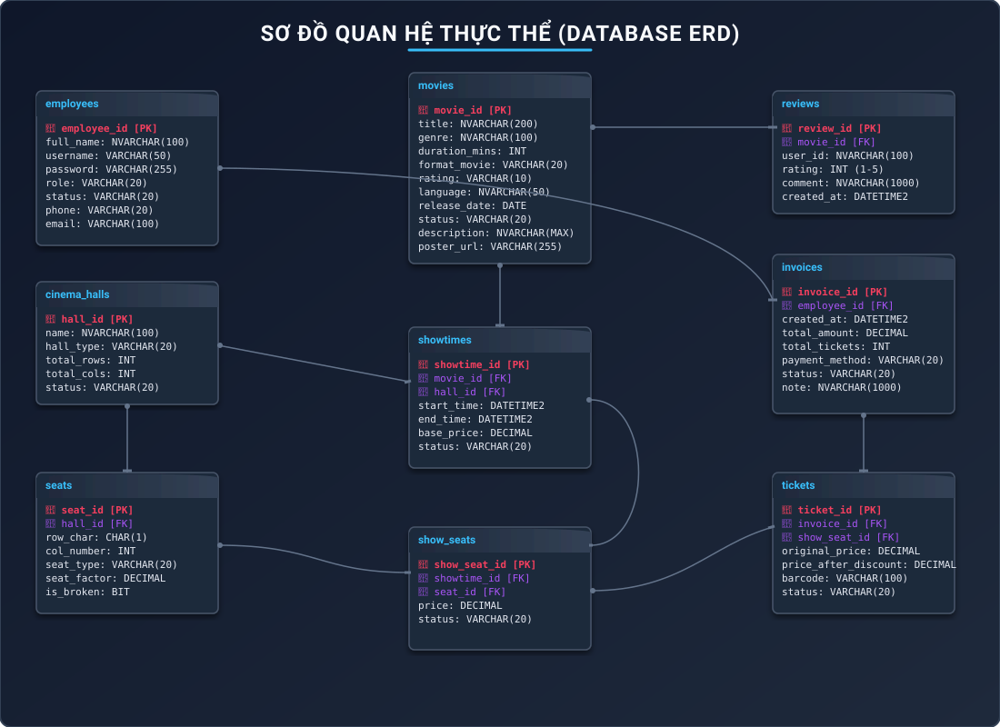

# Entity Relationship Diagram (ERD)
## Project Name: RapPhim - Modern Cinema POS & Ticket Management System
**Document Version:** 2.0 (Updated with discounts and show seat hold columns)

---

## 1. Entity-Relationship Diagram (3NF)

---

## 2. Relational Schema Compliance (3NF Analysis)

* **First Normal Form (1F):** Every column contains atomic values, and every record has a unique identifier (Primary Key).
* **Second Normal Form (2F):** All non-key fields depend entirely on the primary key, eliminating partial dependencies. (For instance, physical seats and show seats are split so that theater layout configurations do not replicate across individual film schedules).
* **Third Normal Form (3NF):** There are no transitive dependencies. (E.g. Invoice records store `employee_id`, and employee metadata remains inside the `employees` table. Showtime rates depend on base prices, and individual ticket pricing calculations do not pollute the main transaction files).
