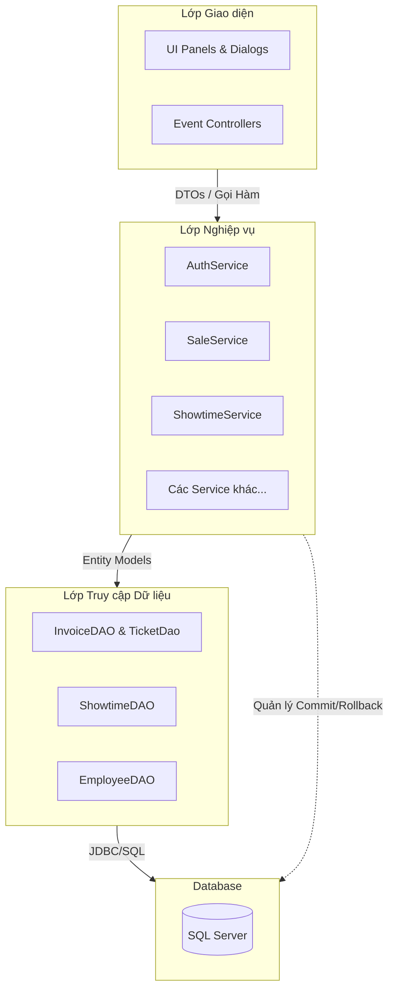
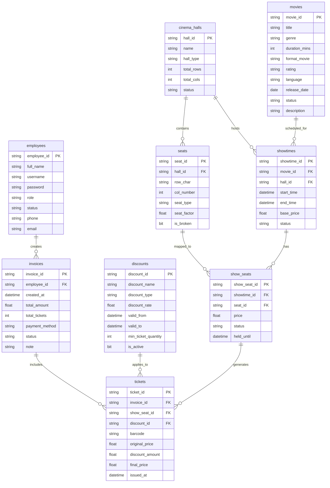

# Phân tích Hệ thống & Thiết kế Kiến trúc
**Dự án:** Hệ thống Quản lý và Bán vé Rạp chiếu phim (CinePro)

---

## 1. Phân tích Kiến trúc
Dự án áp dụng chặt chẽ **Kiến trúc 3 Lớp (3-Tier Architecture)** nhằm đảm bảo tính phân tách (Separation of Concerns), dễ bảo trì và dễ mở rộng.

### 1.1 Sơ đồ Kiến trúc

### 1.2 Trách nhiệm từng Lớp
*   **Lớp Giao diện (UI/Panel):** Nhận input từ người dùng, kiểm tra định dạng giao diện, và gọi các phương thức trong Service. *Tuyệt đối không chứa logic SQL.*
*   **Lớp Nghiệp vụ (Service):** Điều phối luồng xử lý. Ví dụ: `SaleService.processCheckout()` quản lý transaction, sinh mã ID, cập nhật trạng thái ghế và lưu hóa đơn - tất cả nằm trong một chu trình nguyên tử (atomic).
*   **Lớp Dữ liệu (DAO):** Chuyên tương tác cơ sở dữ liệu. Chỉ chứa SQL thô (`INSERT`, `SELECT`, `UPDATE`), xử lý `PreparedStatement` và ánh xạ `ResultSet`.

---

## 2. Thiết kế Cơ sở Dữ liệu (ERD & Data Dictionary)

### 2.1 Sơ đồ Thực thể - Liên kết (ERD)

### 2.2 Từ điển Dữ liệu (Các bảng Transaction cốt lõi)
| Tên Bảng | Mô tả | Ràng buộc & Chỉ mục (Indexes) |
| :--- | :--- | :--- |
| `show_seats` | Quản lý trạng thái động của một chiếc ghế vật lý trong một suất chiếu cụ thể. | Trạng thái: `AVAILABLE`, `BOOKED`, `BROKEN`. Khuyến nghị tạo Index trên `showtime_id, seat_id` để tăng tốc độ tìm kiếm khi thanh toán. |
| `tickets` | Vé vật lý / vé điện tử cấp cho khách hàng. | FK liên kết tới `invoice_id`. Unique constrain trên cột `barcode`. |
| `showtimes` | Ngăn chặn trùng lặp lịch chiếu dựa trên thời gian. | Cần có Check constraint đảm bảo `end_time > start_time`. |

### 2.3 Quản lý Giao dịch (Transaction) & Tính toàn vẹn (ACID)
Thao tác phức tạp và nhạy cảm nhất là **Thanh toán vé (Checkout)**.
Để chống lỗi xung đột (ví dụ: 2 nhân viên bán cùng 1 ghế tại 1 giây), `SaleService` buộc phải vô hiệu hóa auto-commit (`conn.setAutoCommit(false)`). 
1. Đọc bảng `show_seats` để kiểm tra `status = 'AVAILABLE'`.
2. Cập nhật `show_seats` thành `BOOKED`.
3. Thêm mới dữ liệu vào `Invoices` và `Tickets`.
4. Hoàn tất giao dịch (`conn.commit()`).
*Chỉ cần một thao tác thất bại, toàn bộ khối lệnh sẽ bị rollback, bảo toàn dữ liệu tuyệt đối.*
