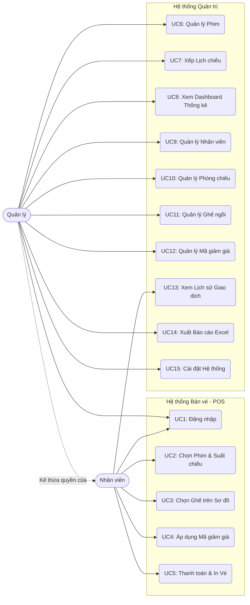
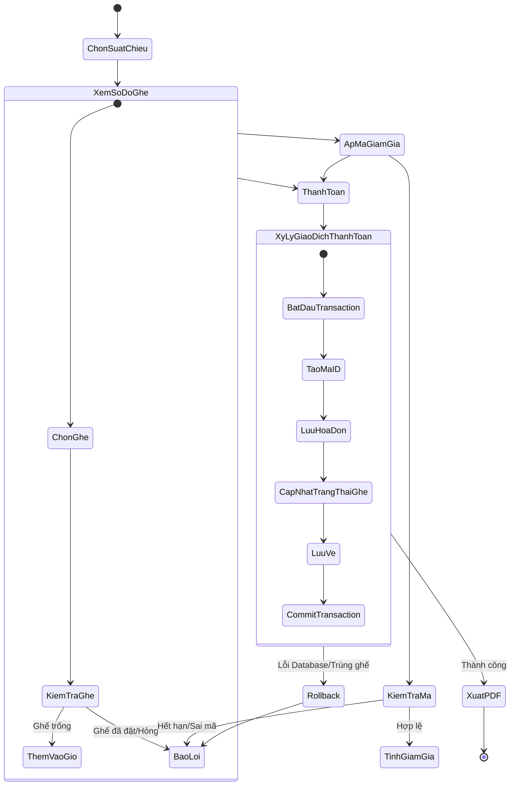
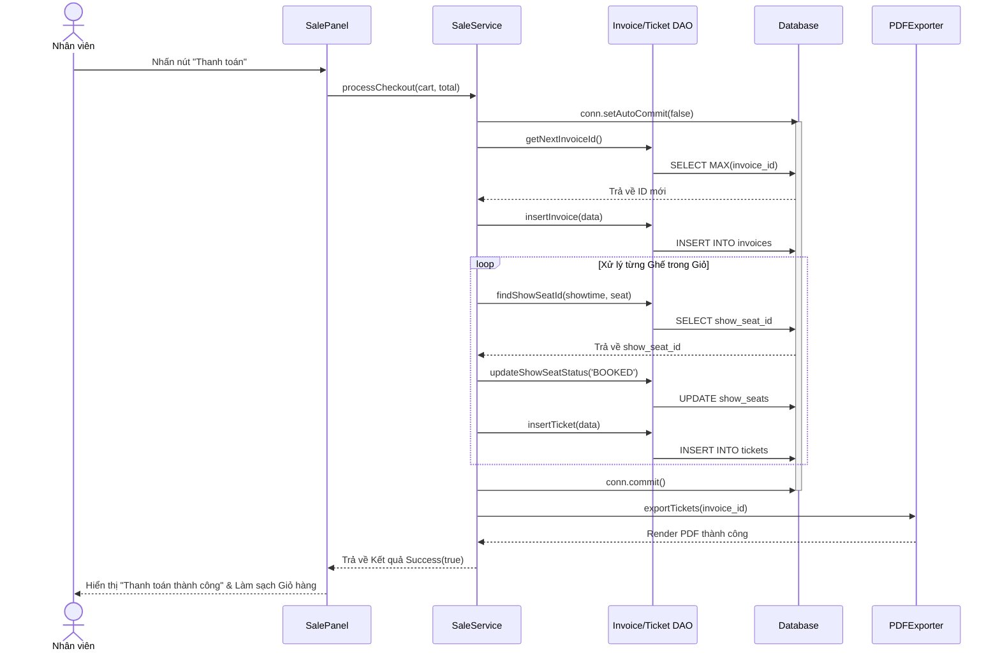

# Use Cases, Luồng Nghiệp vụ (Workflows) & Quy trình
**Dự án:** Hệ thống Quản lý và Bán vé Rạp chiếu phim (CinePro)

---

## 1. Sơ đồ Use Case Tổng thể

---

## 2. Đặc tả Use Case (Use Case Specifications)

### UC5: Thanh toán & In Vé (Checkout)
| Thuộc tính | Mô tả |
| :--- | :--- |
| **Actor** | Nhân viên quầy vé (Staff) |
| **Tiền điều kiện (Pre-condition)** | Nhân viên đã đăng nhập; Có ít nhất 1 ghế trong giỏ hàng. |
| **Luồng chính (Main Flow)** | 1. Nhân viên nhấn nút 'Thanh toán'. 2. Hệ thống kiểm tra trạng thái ghế hiện tại. 3. Nhân viên chọn hình thức thanh toán. 4. Hệ thống tạo Mã hóa đơn và Vé. 5. Hệ thống đổi trạng thái ghế sang 'BOOKED'. 6. Hệ thống xuất file PDF và yêu cầu in. |
| **Luồng phụ (Alternative Flow)** | Nếu có nhập Mã giảm giá, hệ thống sẽ trừ tiền khuyến mãi vào tổng thanh toán ở bước 3. |
| **Luồng ngoại lệ (Exception Flow)** | Nếu ghế đã bị máy khác mua mất (Trùng ghế), hệ thống hủy thanh toán, báo lỗi cho nhân viên và làm mới lại sơ đồ ghế. |
| **Hậu điều kiện (Post-condition)** | Hóa đơn và Vé được lưu vào Database. File PDF được sinh ra. Sơ đồ ghế đã bị khóa. |

---

## 3. Phân tích Luồng Nghiệp vụ (BPMN & Flow)

### 3.1 Sơ đồ Hoạt động Bán vé (BPMN Style)

### 3.2 Sơ đồ Tuần tự (Sequence Diagram): Luồng Thanh toán Database

