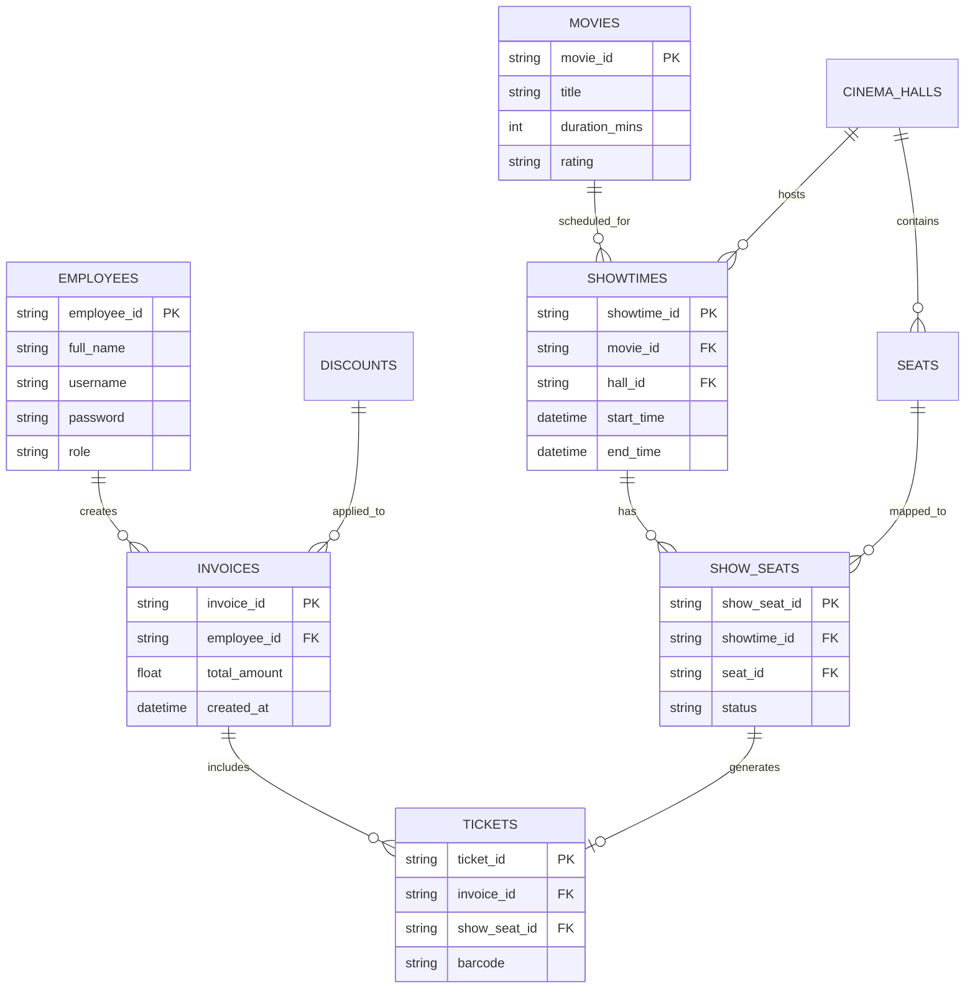

# System Analysis & Architecture Design
**Project:** CinePro Management & POS System

---

## 1. Architectural Analysis
The project strictly implements a **3-Tier Architecture** ensuring separation of concerns, scalability, and clean data flow.

### 1.1 Architecture Diagram

```mermaid
graph TD
    subgraph View Layer [Presentation Tier]
        UI[UI Panels & Dialogs]
        Controllers[Event Controllers]
    end

    subgraph Service Layer [Business Tier]
        AuthSvc[AuthService]
        SaleSvc[SaleService]
        ShowSvc[ShowtimeService]
        OtherSvc[Other Services...]
    end

    subgraph DAO Layer [Data Tier]
        SaleDAO[InvoiceDAO & TicketDao]
        ShowDAO[ShowtimeDAO]
        UserDAO[EmployeeDAO]
    end

    subgraph Database
        SQL[(SQL Server)]
    end

    UI -->|DTOs / Data| Service Layer
    Service Layer -->|Entity Models| DAO Layer
    DAO Layer -->|JDBC/SQL| Database
    
    %% Transaction Management highlights
    Service Layer -.->|Controls Commit/Rollback| Database
```

### 1.2 Layer Responsibilities
*   **Presentation Layer (UI):** Captures user inputs, validates UI-level formatting, and calls Service methods. *No SQL logic.*
*   **Business Logic Layer (Service):** Orchestrates workflows. Example: `SaleService.processCheckout()` handles atomicity, generates IDs, updates seat statuses, and saves tickets all within a single transaction boundary.
*   **Data Access Layer (DAO):** Pure database interaction. Contains raw SQL queries, `PreparedStatement`, and `ResultSet` mapping.

---

## 2. Database Analysis (Data Dictionary & ERD)

### 2.1 Entity Relationship Diagram (ERD)



### 2.2 Data Dictionary (Key Transaction Tables)
| Table Name | Description | Key Constraints & Indexes |
| :--- | :--- | :--- |
| `show_seats` | Tracks the dynamic status of a physical seat for a specific showtime. | `status` (AVAILABLE, BOOKED, BROKEN). *Index recommended on `showtime_id, seat_id` for fast checkout lookup.* |
| `tickets` | The physical ticket granted to a customer. | FK to `invoice_id`. Unique constraint on `barcode`. |
| `showtimes` | Overlap prevention relies on `start_time` and `end_time` logic. | Check constraints ensure `end_time > start_time`. |

### 2.3 Transaction Management & ACID Analysis
The most critical database operation is the **Ticket Checkout**. 
To prevent race conditions (two staff members booking the same seat simultaneously), the `SaleService` disables auto-commit (`conn.setAutoCommit(false)`). 
1. Reads `show_seats` to ensure `status = 'AVAILABLE'`.
2. Updates `show_seats` to `BOOKED`.
3. Inserts `Invoice` and `Tickets`.
4. Commits transaction (`conn.commit()`).
*If any constraint fails, the entire block rolls back, guaranteeing data integrity.*
