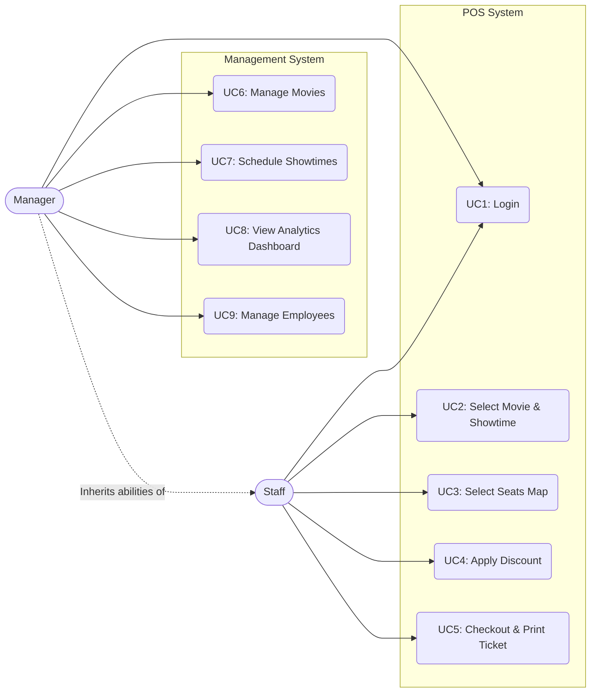
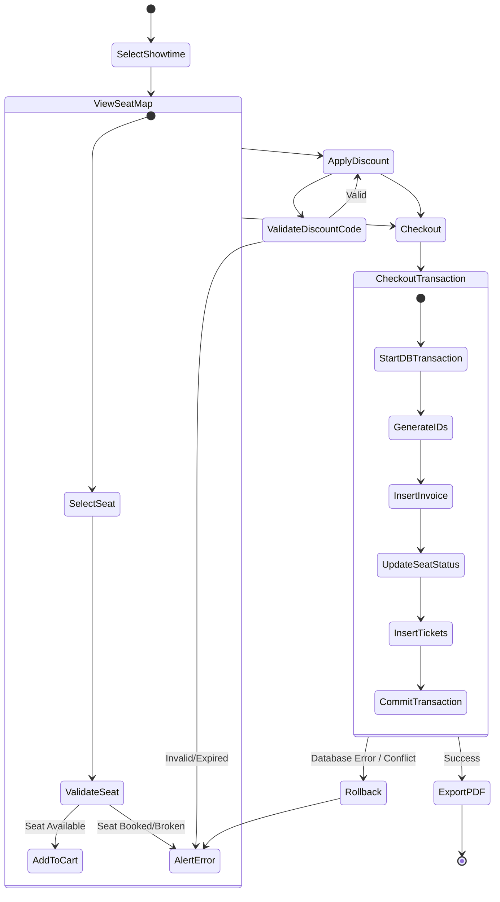
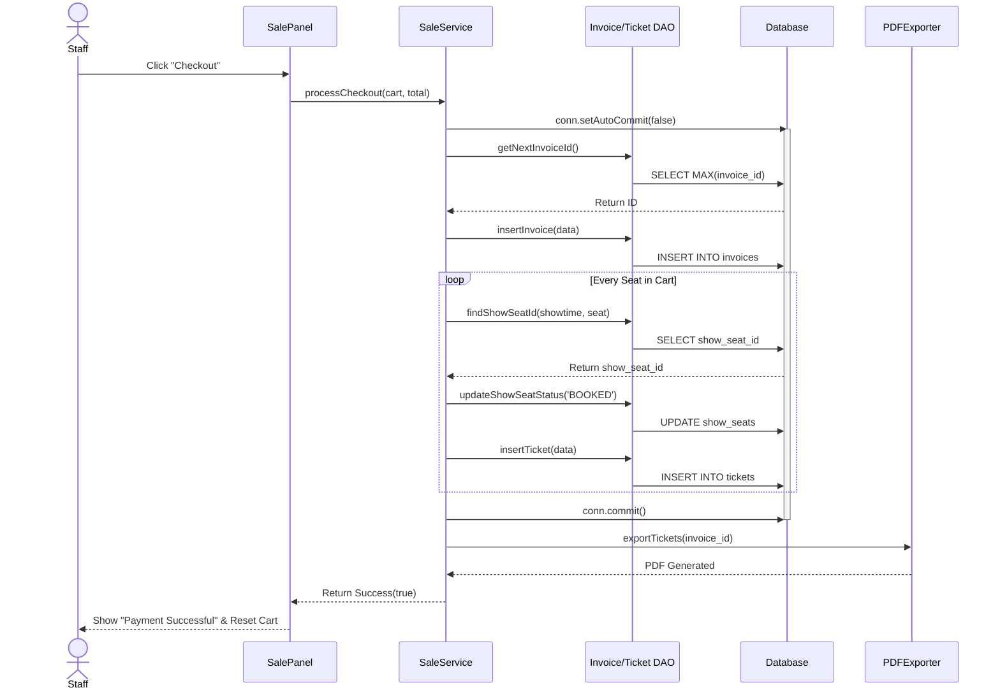

# Use Cases, Workflows & Process Design

**Project:** CinePro Management & POS System

---

## 1. System Use Case Diagram

---

## 2. Use Case Specifications

### UC5: Checkout & Print Ticket

| Attribute                  | Description                                                                                                                                                                                                                                                         |
| :------------------------- | :------------------------------------------------------------------------------------------------------------------------------------------------------------------------------------------------------------------------------------------------------------------ |
| **Actor**            | Box Office Staff                                                                                                                                                                                                                                                    |
| **Pre-condition**    | Staff is logged in; At least 1 seat is added to the cart.                                                                                                                                                                                                           |
| **Main Flow**        | 1. Staff clicks 'Checkout'.` `2. System validates seat availability.` `3. Staff selects payment method.` `4. System generates Invoice and Tickets.` `5. System updates seat status to 'BOOKED'.` `6. System exports PDF and prompts print. |
| **Alternative Flow** | If Discount is applied, system calculates final total before step 3.                                                                                                                                                                                                |
| **Exception Flow**   | If a seat is already booked by another terminal (Race Condition), system aborts checkout, alerts Staff, and refreshes the seat map.                                                                                                                                 |
| **Post-condition**   | Invoice and Tickets saved to DB. PDF generated. Seat map locked.                                                                                                                                                                                                    |

---

## 3. Workflows & BPMN Analysis

### 3.1 Ticket Booking Activity Diagram (BPMN Style)

### 3.2 Sequence Diagram: Checkout Transaction Execution

---

## 4. Stakeholder & Exception Thinking

* **Exception Handling:** The Sequence Diagram above clearly maps out why `setAutoCommit(false)` is crucial. If the loop fails on the 3rd seat (e.g., database timeout), the `conn.rollback()` is triggered. No phantom invoices or partial tickets will be left in the database, preventing accounting nightmares.
